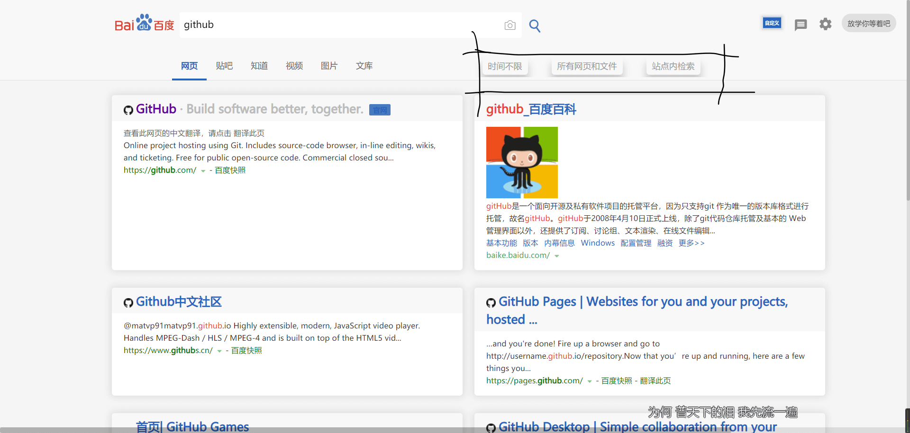

# chrome-extension-stylish

## 简介

> :star2: [Stylish](https://github.com/stylish-userstyles/stylish) offers customization and personalization for the appearance of virtually any webpage in the world through styles created by the Stylish community.

**此仓库存储了 本人 Stylish 用到的所有样式。**

欢迎Star、使用。

## 如何（恢复）备份

1. 下载 [Stylish](https://chrome.google.com/webstore/detail/stylish-custom-themes-for/fjnbnpbmkenffdnngjfgmeleoegfcffe)

2. 下载 [我的备份](https://github.com/Tomotoes/stylish/archive/v1.0.zip)

3. 文件夹中的 `stylish-*.json,.bin,.dms` 即是备份文件

4. 点击 Stylish 扩展图标

5. 点击任意一款 Stylish 的`Edit` :pen: 按钮 , 进入编辑界面

6. 在左侧侧边栏中, 点击 `返回进行管理操作`

7. 在左侧侧边栏中, 

   - 点击 `检索备份` , 选择`stylish-*.json,.bin,.dms`, 即可恢复备份
   - 点击 `备份所有已安装样式` , 即可备份所有主题

8. 备份之后需要重新下载一下 [微软雅黑](http://userstyles.org/styles/126234) 风格

   因为备份之后文件中所有中文字符都会变成乱码.

   而只有 `微软雅黑` 中的字体配置有中文 , 其他文件都是注释中含有中文 , 无所谓了。

   
## 截图

1. 我为 [Google](https://www.google.com) 创造的 [Stylish](https://userstyles.org/styles/168170/tomotoes-for-google)

  

2. 我为 [Baidu](https://www.baidu.com) 创造的 [Stylish](https://userstyles.org/styles/168173/tomotoes-for-baidu)
  

2. 我为 [ECMAScript 6 入门](http://es6.ruanyifeng.com/) 创造的 [Stylish](https://userstyles.org/styles/168173/tomotoes-for-baidu)
  .jpg)